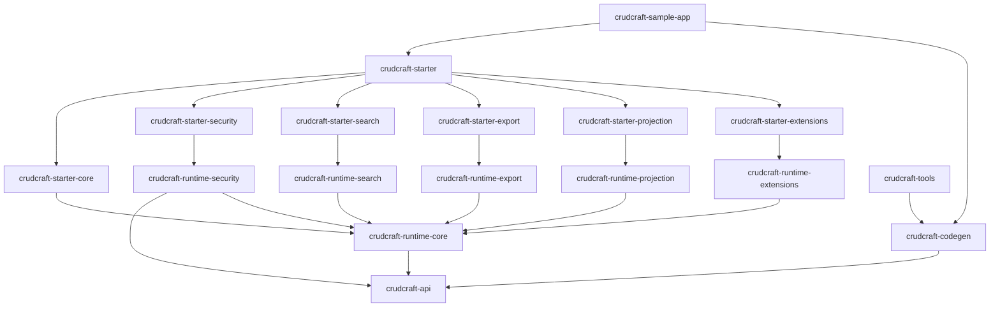

# CrudCraft Governance-First Overview

Get started quickly: [Quick Start Guide](docs/quick-start/README.md).

## Module Index

| Module | Responsibility | Public API |
|---|---|---|
| `crudcraft-api` | Annotations and contracts | Java annotations in `nl.datasteel.crudcraft.annotations.*` |
| `crudcraft-codegen` | Annotation processing and source generation | Processor entrypoint and generated contracts |
| `crudcraft-runtime-core` | Core CRUD runtime | `AbstractCrudController`, `AbstractCrudService` |
| `crudcraft-runtime-security` | Field/row security runtime | row/field security extensions |
| `crudcraft-runtime-search` | Search request and execution support | `SearchRequest`, `SearchOperations` |
| `crudcraft-runtime-export` | Export runtime | export request/serialization services |
| `crudcraft-runtime-projection` | Projection runtime | projection metadata/executor APIs |
| `crudcraft-runtime-extensions` | Cross-cutting runtime extensions | extension hooks |
| `crudcraft-starter-*` | Spring Boot composition/autoconfig | starter auto-configuration imports |
| `crudcraft-starter` | Umbrella starter | consolidated dependency surface |
| `crudcraft-tools` | build-time helper tooling | editable file tooling |
| `crudcraft-sample-app` | reference integration app | runnable sample endpoints |

## Dependency Graph

## Change Impact Map

- `crudcraft-api` change: retest `crudcraft-codegen` and all touched runtime/starter paths.
- `crudcraft-codegen` change: rerun codegen unit tests and sample compile path.
- `crudcraft-runtime-core` change: retest runtime-core plus dependent runtime modules.
- `crudcraft-starter-*` change: retest starter module and sample bootstrapping.
- Public API contract rules: [STABILITY.md](STABILITY.md).
- Generated source contract rules: [docs/generated-code-contract.md](docs/generated-code-contract.md).
- 2.x release readiness gates: [docs/2x-release-readiness.md](docs/2x-release-readiness.md).
- Release history: [CHANGELOG.md](CHANGELOG.md).
- Full matrix: [docs/governance/change-impact-matrix.md](docs/governance/change-impact-matrix.md)

## Contributor Fast Paths

1. Feature: implement -> `scripts/quality-loop.ps1` -> `mvn verify` -> docs update.
2. Bugfix: minimal diff -> targeted tests -> full verify.
3. Release: follow [docs/maintainers/release-process.md](docs/maintainers/release-process.md).

## Non-Goals

CrudCraft does not:

1. generate business workflows or domain service logic,
2. choose application-specific caching/query-tuning strategy,
3. provide authentication providers or identity management,
4. generate GraphQL/gRPC surfaces (REST-first scope),
5. replace application-level audit/compliance policy design.

## Edit Flow Gate

`mvn verify` is the fast full reactor gate. PIT mutation coverage is intentionally opt-in locally:
run `mvn verify -Pmutation` when you need the full mutation gate.

## Documentation

- [docs/README.md](docs/README.md)
- [ARCHITECTURE.md](ARCHITECTURE.md)
- [docs/README.md](docs/README.md)
- [docs/feature-guides/](docs/feature-guides/)
- [docs/contributor-handbook/](docs/contributor-handbook/)
