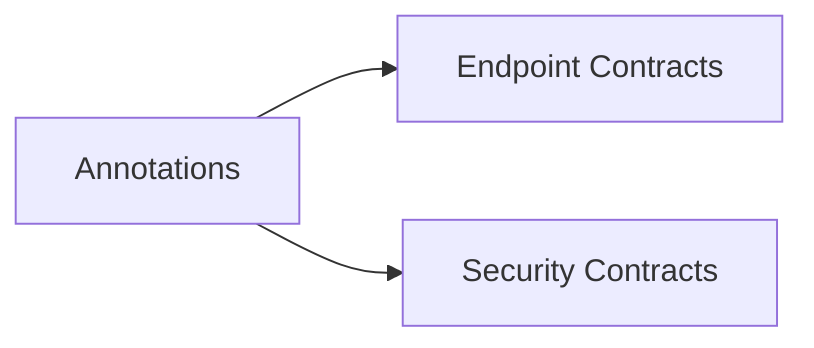

# crudcraft-api

## Module Purpose
Public annotations and contracts used by codegen and runtime.

## Inbound and Outbound Dependencies
- Inbound: vrijwel alle `crudcraft-*` modules.
- Outbound: geen interne runtime afhankelijkheid.

## Public Contracts
Annotaties onder `nl.datasteel.crudcraft.annotations.*`.

## What Breaks If Changed
Signature changes break codegen and runtime interoperability.

## Test Strategy
Contract and annotation behavior tests through dependent module tests.

## Javadoc Expectations
All public annotations and policies document intent and usage.

