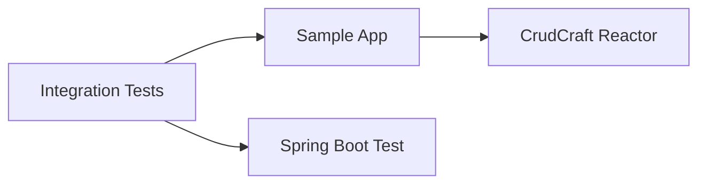

# crudcraft-integration-tests

## Module Purpose
Cross-module integration checks that exercise the sample application as a packaged consumer of the
CrudCraft reactor.

## Inbound and Outbound Dependencies
- Inbound: release and CI verification when full integration coverage is enabled.
- Outbound: `crudcraft-sample-app`, Spring Boot test support, MVC test support, and JWT test
  utilities.

## Public Contracts
This module is test-only and is not deployed. Its contract is the integration coverage it provides
for generated endpoints, starter wiring, and sample application behavior.

## What Breaks If Changed
End-to-end regressions can escape the release pipeline if this module stops exercising the packaged
sample application as a real consumer.

## Test Strategy
Keep tests focused on cross-module behavior that is not already proven by unit tests or sample-app
module tests.

## Javadoc Expectations
No public API is published from this module. Test helpers should be readable without generated
Javadocs.

