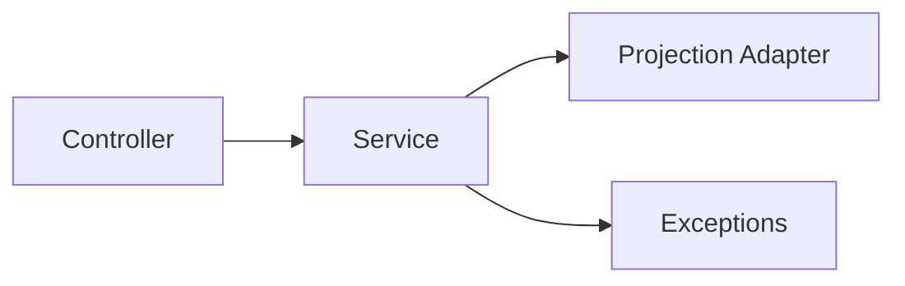

# crudcraft-runtime-core

## Module Purpose
Core runtime for CRUD controllers, services, exceptions, and paging.

## Inbound and Outbound Dependencies
- Inbound: runtime/search/export/projection/security modules and starters.
- Outbound: `crudcraft-api`.

## Public Contracts
`AbstractCrudController`, `AbstractCrudService`, response, and exception types.

## What Breaks If Changed
Endpoint behavior, service flow, and compatibility with extensions/starters.

## Test Strategy
Unit tests for service/controller behavior and boundary tests.

## Javadoc Expectations

## Operational Contract

- Threading: generated services are singleton beans and inherit the thread-safe core contract. Subclasses and runtime extensions must stay stateless or protect their own state.
- Lifecycle: repositories, mappers, query executors, extension caches, and JPA metamodel metadata are initialized once per service bean.
- Errors: missing resources throw `ResourceNotFoundException`; invalid requests throw `BadRequestException`; mapper failures are wrapped with operation/entity/request context.
- Configuration: see `docs/configuration-reference.md` for `crudcraft.api.max-page-size` and related runtime limits.
- Extension points: `CrudRuntimeExtension`, `EntityMapper`, and `ProjectionAdapter` are the supported integration boundaries.
Public runtime contracts must describe lifecycle and threading assumptions.

