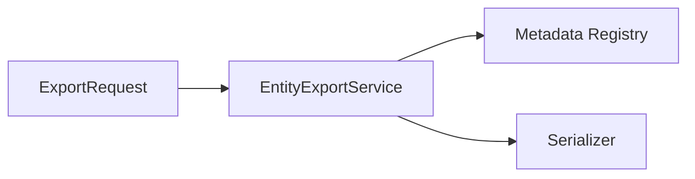

# crudcraft-runtime-export

## Module Purpose
Export request handling and entity serialization.

## Inbound and Outbound Dependencies
- Inbound: starter-export and services that enable export.
- Outbound: `crudcraft-runtime-core`.

## Public Contracts
`EntityExportService`, `ExportRequest`.

## What Breaks If Changed
Export API behavior and CSV/Excel output contracts.

## Test Strategy
Unit tests for metadata and serializer paths.

## Javadoc Expectations

## Operational Contract

- Threading: export services are Spring singletons and are thread-safe when collaborators are thread-safe.
- Lifecycle: streaming exports page through service callbacks; entity-mode metadata is resolved through `EntityMetadataRegistry`.
- Errors: row limits return HTTP 413; non-exportable fields and excessive depth fail before querying; prefetch degradation is logged with context.
- Configuration: see `docs/configuration-reference.md` for row, page, depth, and strict fetch settings.
- Extension points: customize DTO export through generated services; use entity mode only for trusted/internal exports.
Contracts for formats, field exclusion, and failure scenarios.

