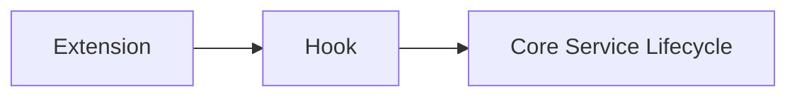

# crudcraft-runtime-extensions

## Module Purpose

Runtime extensions for cross-cutting generated service behavior such as soft delete, auditing, and
relationship helper compatibility.

## Inbound and Outbound Dependencies

- Inbound: `crudcraft-starter-extensions` and generated services using the runtime-core extension
  chain.
- Outbound: `crudcraft-runtime-core`.

## Public Contracts

This module exposes runtime extension implementations and the deprecated relationship utility
facade kept for module-path compatibility.

## Relationship Utility Migration

Use `nl.datasteel.crudcraft.runtime.util.RelationshipUtils` from runtime-core for new code. The old
`nl.datasteel.crudcraft.runtime.extensions.util.RelationshipUtils` facade is marked `forRemoval =
true` so compiler output makes migration visible, but it remains available until the documented
2.1.0 removal window. Generated code already imports the runtime-core utility.

Generated relationship metadata does not recursively traverse arbitrary object graphs. It fixes or
clears only the direct owning/inverse fields described by generated metadata, which keeps
bidirectional cycles from causing recursive fixup loops. If a domain model needs deeper graph
repair, implement that as an explicit runtime extension with its own cycle guard.

## What Breaks If Changed

Changing hook ordering or mutation behavior can change generated CRUD lifecycle semantics.

## Test Strategy

Unit tests cover extension helpers, relationship compatibility, deprecation behavior, and migration
paths.

## Javadoc Expectations

## Operational Contract

- Threading: runtime extensions are invoked by singleton services and must be stateless unless explicitly synchronized.
- Lifecycle: extensions are discovered from Spring context and subclass hooks, then cached by the service collaborator layer.
- Errors: extension exceptions propagate with service context; use domain-specific `CrudCraftRuntimeException` subclasses for actionable failures.
- Configuration: extension modules do not own global properties; extensions may define their own application properties.
- Extension points: `CrudRuntimeExtension` hooks cover read filters, create/update preparation, save/delete hooks, and after-read transformation.

Document hook ordering, mutation expectations, and migration behavior for deprecated compatibility
APIs.

