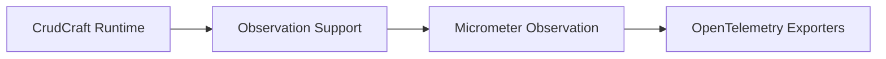

# crudcraft-runtime-observability

## Module Purpose
Auto-configured observability support for CrudCraft runtime operations.

## Inbound and Outbound Dependencies
- Inbound: applications that export Micrometer observations to OpenTelemetry.
- Outbound: `crudcraft-runtime-core`, Micrometer Observation, and Spring Boot auto-configuration.

## Public Contracts
`CrudCraftObservationSupport` and `CrudCraftObservabilityAutoConfiguration`.

## What Breaks If Changed
Span names and low-cardinality tag names used by OpenTelemetry dashboards.

## Test Strategy
Auto-configuration tests verify bean registration and user override behavior.

## Javadoc Expectations

## Operational Contract

- Threading: observation support is stateless and delegates to Micrometer/OpenTelemetry thread-safe infrastructure.
- Lifecycle: auto-configuration contributes observation helpers when observability dependencies are present.
- Errors: observation failures must not change CRUD behavior.
- Configuration: use standard Micrometer/OpenTelemetry Spring Boot properties.
- Extension points: wrap generated services or controllers with the provided observation support.
Public helpers document span names, tag names, and operation wrapping behavior.

