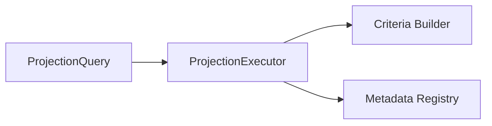

# crudcraft-runtime-projection

## Module Purpose
Projection metadata and execution for selective payloads.

## Inbound and Outbound Dependencies
- Inbound: starter-projection and the runtime-core projection adapter.
- Outbound: `crudcraft-runtime-core`.

## Public Contracts
`ProjectionExecutor`, `ProjectionQuery`, metadata registry.

## What Breaks If Changed
Projection API output, filtering, and query mapping.

## Test Strategy
Unit tests plus JPA integration tests in this module.

## Javadoc Expectations

## Operational Contract

- Threading: projection executors are singleton-safe and keep no per-request mutable state.
- Lifecycle: generated projection metadata is cached in registries; JPA execution validates metadata before querying.
- Errors: cyclical or too-deep metadata fails fast with entity/dto context; execution failures include projection diagnostics.
- Configuration: see `docs/configuration-reference.md` for `crudcraft.projection.max-depth`.
- Extension points: generated `ProjectionMetadata` and `ProjectionExecutor` are the supported boundaries.
Contracts for projection syntax, filtering, and limits.

