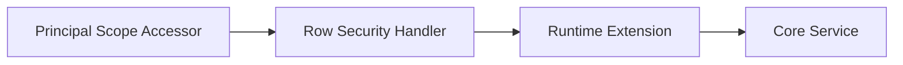

# crudcraft-runtime-security

## Module Purpose
Field-level and row-level security runtime extensions.

## Inbound and Outbound Dependencies
- Inbound: starter-security and runtime-core secured services.
- Outbound: `crudcraft-api`, `crudcraft-runtime-core`.

## Public Contracts
Scope accessors, row handlers, and field security utilities.

## What Breaks If Changed
Authorization behavior and data exposure guarantees.

## Test Strategy
Unit tests for handlers/utilities plus sample security smoke tests.

## Javadoc Expectations

## Operational Contract

- Threading: security adapters and row handlers must be stateless or use thread-safe collaborators.
- Lifecycle: field and row security metadata is generated at compile time and consumed during service calls.
- Errors: denied writes follow the configured `WritePolicy`; missing claims produce empty scoped reads unless a custom handler rejects them.
- Configuration: see security feature guides for claim names and role expressions.
- Extension points: implement custom row security handlers or field security adapters.
Document security invariants and trust boundaries.

