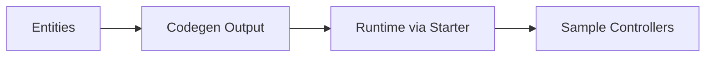

# crudcraft-sample-app

## Module Purpose
Reference app that demonstrates the full generated CRUD stack.

## Inbound and Outbound Dependencies
- Inbound: maintainers/contributors for validation.
- Outbound: `crudcraft-starter` and codegen output.

## Public Contracts
Example controllers, security flows, and integration behavior.

## What Breaks If Changed
Integration validation path and documentation examples.

## Test Strategy
Smoke/integration tests for security, endpoints, and runtime features.

## Run Locally

The sample security flow needs `crudcraft.security.jwt.secret` (minimum 32 chars).
Set `CRUDCRAFT_JWT_SECRET` before starting the app; neither the default profile nor the demo
profile ships a fallback secret. The demo profile also keeps the H2 console disabled by default.

Use one of these startup modes:

1. Demo profile:
   `mvn -pl crudcraft-sample-app spring-boot:run -Dspring-boot.run.profiles=demo`
2. Environment variable:
   set `CRUDCRAFT_JWT_SECRET` and run without profile.

## TCK & Coverage Matrix
The sample app is the generated-code TCK for CrudCraft. The matrix in
`src/test/resources/tck-matrix.md` describes every contract that generated
code must keep providing. `TckMatrixCoverageTest` fails when a matrix row no
longer has `@Tag("tck:...")` evidence and writes on every test run
`target/tck-coverage.md`.

The Spring Boot integration tests inherit from `PostgresIntegrationTestBase`.
Locally they fall back to the existing H2 configuration when Docker is not
available; CI sets `-Dcrudcraft.tck.postgres.required=true`, which requires
the TCK to run against Testcontainers PostgreSQL.

The generated-artifact PIT gate targets the generated DTO, search request, and
controller round trip. The sample-app build fails below 95% mutation coverage,
line coverage, or test strength.

## Javadoc Expectations
Public sample APIs document expected behavior for readers.

## Scenario Modules
The sample is organized as bounded feature modules under one Spring Boot app:

- `nl.datasteel.crudcraft.sample.scope`: multi-tenant/client/owner row-security (`ScopedRecord`)
- `nl.datasteel.crudcraft.sample.blog.content`: JPA inheritance (`Content` -> `Article` / `Tutorial`)
- `nl.datasteel.crudcraft.sample.user`: secured surface with field redaction and export filtering

This keeps one runnable app while still exercising the cross-module runtime combinations that
production adopters usually compose from separate bounded contexts.

