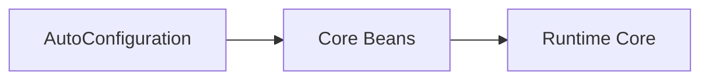

# crudcraft-starter-core

## Module Purpose
Auto-configuration for the core runtime.

## Inbound and Outbound Dependencies
- Inbound: umbrella starter and applications.
- Outbound: `crudcraft-runtime-core`.

## Public Contracts
Spring Boot auto-configuration imports.

## What Breaks If Changed
Bootstrapping of core beans.

## Test Strategy
Auto-configuration tests.

## Javadoc Expectations
Public configuration classes document expected bean registration behavior.

