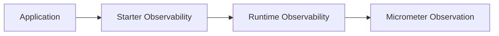

# crudcraft-starter-observability

## Module Purpose
Spring Boot starter that brings in CrudCraft observability auto-configuration.

## Inbound and Outbound Dependencies
- Inbound: umbrella starter and applications that want observability support.
- Outbound: `crudcraft-runtime-observability`.

## Public Contracts
Starter dependency metadata and auto-configuration imports exposed through the runtime
observability module.

## What Breaks If Changed
Applications can lose observation helpers, span naming, or Micrometer/OpenTelemetry integration
when starter composition changes unexpectedly.

## Test Strategy
Context-load and auto-configuration tests should verify that user-defined beans still override
starter defaults.

## Javadoc Expectations
Starter classes document which runtime observability contracts they import and when they activate.

