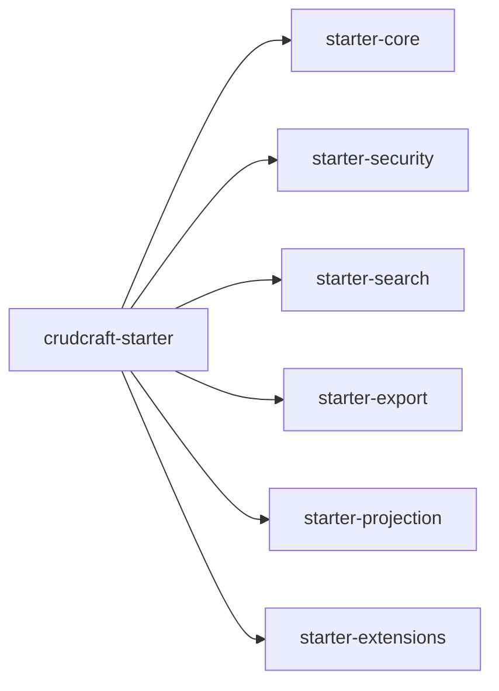

# crudcraft-starter

## Module Purpose
Umbrella starter die alle capability starters bundelt.

## Inbound and Outbound Dependencies
- Inbound: applicaties die volledige CrudCraft stack willen.
- Outbound: alle `crudcraft-starter-*` modules.

## Public Contracts
Dependency surface for complete CrudCraft enablement.

## What Breaks If Changed
Transitive dependency set and defaults in consumer apps.

## Test Strategy
Starter context tests and sample app integration.

## Javadoc Expectations
Document module composition and expected sub-starter presence.

