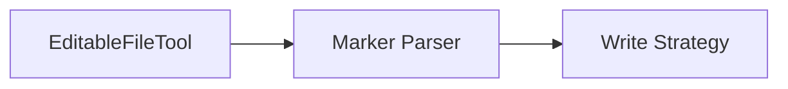

# crudcraft-tools

## Module Purpose
Helper tooling for editable file workflows and codegen support utilities.

## Inbound and Outbound Dependencies
- Inbound: `crudcraft-codegen` workflows.
- Outbound: geen runtime contracts.

## Public Contracts
`EditableFileTool` API.

## What Breaks If Changed
Editable region preservation and generation tooling behavior.

## Test Strategy
Unit tests for preserve/merge scenarios.

## Javadoc Expectations
Document marker rules and conflict behavior.

